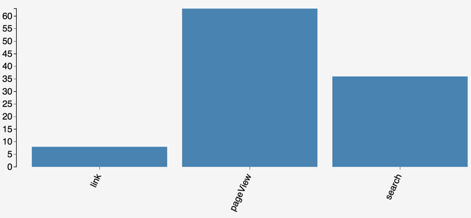
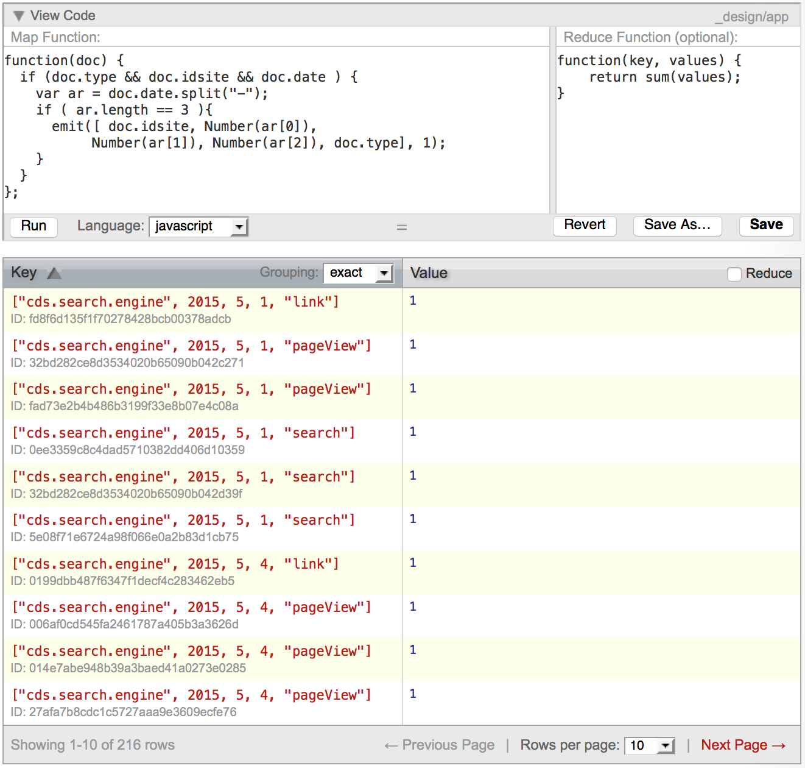
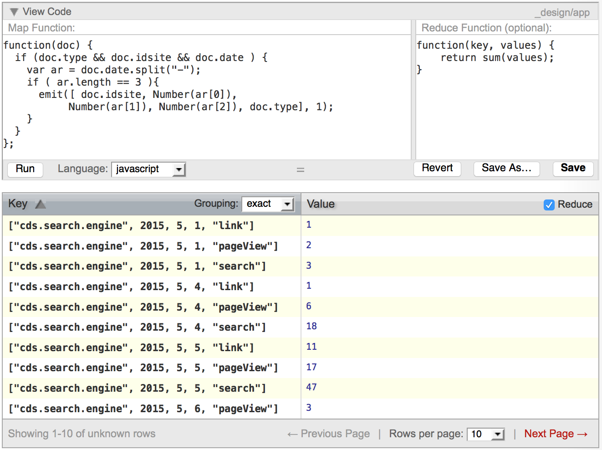
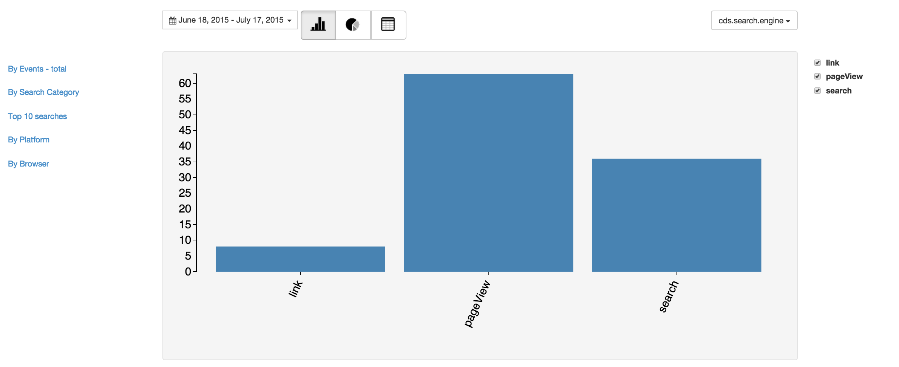

# Super Simple Metrics Tutorial
# Part 2: Metrics Analytics

The metrics collection aspect of this tutorial is now complete, but metrics aren't that useful without reports containing attention-getting visuals. Remember the whole reason to capture metrics is to understand how users engage with your apps by analyzing usage data in ways that expose interesting insights.

In part 2 of the tutorial, we use Cloudant's (and CouchDB's) [MapReduce](https://cloudant.com/product/cloudant-features/mapreduce/) to create various summaries of the metrics data, then we pump that data into [D3](http://www.d3js.org) for visualization.

You can find all the code for this part of the tutorial in the [metrics-analytics GitHub repo](https://github.com/ibm-cds-labs/metrics-analytics). 

## Overview

Here is an architural overview of what the analytics app does. As described in Part 1 of this tutorial, we have user metrics data for [our How-Tos search engine](https://developer.ibm.com/clouddataservices/how-tos/) stored in Cloudant as JSON documents.


## Application Setup

Cloudant and CouchDB contain a simple web server in addition to their database serving capabilities. So we’ll build our application as a CouchApp. A CouchApp lets you package up a set of files for a website — HTML, CSS, Javascript and images — and upload them into your Cloudant/CouchDB database. It also provides a convenient way to write MapReduce views and store them in the database at the same time.

> The drawback to couchapps is that there is no middle tier between the client and the database. This means that any authentication creditials you need for the database, like passwords or API keys, must reside in the client, so the Couchapp strategy is inherently insecure and unfit for production apps. But they’re great for tutorials like this, especially since you can share the web site and the data by simply replicating the database. Just make sure you use the Python CouchApp, as there are a few different strategies for laying out the files. Only the Python style referenced here will work for this tutorial.

All you need to do is run the following at the command line:

```shell
  $ sudo easy_install --upgrade couchapp
```

## Building "views" on the data with MapReduce

Cloudant and CouchDB follow a standard method of analyzing big data sets called [MapReduce](https://en.wikipedia.org/wiki/MapReduce) which works great on distributed, fault-tolerant databases like Cloudant and Apache Hadoop. We use MapReduce here to build views on the metrics data that distill the data set down to a small subset for online graphing with the D3 visualization library. Each chart you'll see in the next section has its own corresponding MapReduce function. We'll walk through one of them in depth here, and the rest will be left as an exercise for the reader. 

Let's first take a look at the final product we want to achieve. The chart below shows the user events grouped by whether they were clicks on links in the page (link), views of the search engine page (pageView), or searches generated by the page (search). We see that for the time period specified, there were about 60 pageViews, about 35 searches, and about 8 link events. 



Now let's look at how we got to that graph. First, let's look at an example event document in the database. If we want to look at the type of event, we'll need to look at the `type` key. And since all visualizations can be constrained by `siteid` and `date`, we'll need those fields also. 

**_Sample tracking event document_**

```json
{
  "type": "search",              //Type of event being captured (currently pageView, search and link)
  "idsite": "cds.search.engine", //app id (must be unique)
  "ip": "75.126.70.43",          //ip of the client
  "url": "http://cloudant-labs.github.io/resources.html",   //source url for the event
  "geo": {                       //geo coordinates of the client (if available)
    "lat": 42.3596328,
    "long": -71.0535177
  }
  "search": "",         //Search text if any (specific to search events)
  "search_cat": [       //Faceted search info (specific to search events)
    {
      "key": "topic",
      "value": "Analytics"
    },
    {
      "key": "topic",
      "value": "Data Warehousing"
    }
  ],
  "search_count": 7,    //search result count (specific to search events)
  "action_name": "IBM Cloud Data Services - Developers Center - Products", //Document title (specific to pageView events)
  "link": "https://developer.ibm.com/bluemix/2015/04/29/connecting-pouchdb-cloudant-ibm-bluemix/", //target url (specific to link events)
  "rec": 1,             //always 1
  "r": 297222,          //random string
  "date": "2015-5-4",    //event date time -yyyy-mm-dd
  "h": 16,              //event timestamp - hour
  "m": 20,              //event timestamp - minute
  "s": 10,              //event timestamp - seconds
  "$_id": "0e9dcf4b6b5b0dc7", //cookie visitor
  "$_idts": 1433860426,       //cookie visitor count
  "$_idvc": 2,          //Number of visits in the session
  "$_idn": 0,           //Whether a new visitor or not
  "$_refts": 0,         //Referral timestamp
  "$_viewts": 1433881201,  //Last Visit timestamp
  "$_ref": '',          //Referral url
  "send_image": 0,      //used image to send payload
  "uap": "MacIntel",     //client platform
  "uab": "Netscape",     //client browser
  "pdf": 1,             //browser feature: supports pdf
  "qt": 0,              //browser feature: supports quickTime
  "realp": 0,           //browser feature: supports real player
  "wma": 0,             //browser feature: supports windows media player
  "dir": 0,             //browser feature: supports director
  "fla": 1,             //browser feature: supports shockwave
  "java": 1,            //browser feature: supports java
  "gears": 0,           //browser feature: supports google gear
  "ag": 0,              //browser feature: supports silver light
  "cookie": 1,          //browser feature: has cookies
  "res": "3360x2100",   //browser feature: screen resolution
  "gt_ms": 51           //Config generation performance generation time
}
```

Now let's look at the "map" part of the MapReduce that produces the data set for the chart. In the graphic below you see the map function in the upper left, and the output of the map function in the table below the functions (ignore the reduce function in the upper right for now). MapReduce functions in Cloudant and CouchDB are regular JavaScript functions that iterate over every document in the database. Hence the input to a map function is a document, the output of a map function is a key/value pair, and the input to a reduce function is the output of the map function. This Map function checks the document for the required fields, and if they are present it creates a key value pair where the key is an array consisting of `idsite`, the date's year, month and day, and the event type. The value is simply the number 1, which we'll use to sum up the results in the reduce step. Notice in this image that there are 3 records that have the `siteid` "cds.search.engine", year "2015", month "5", day "1", and are of type "search". 

> Complete documentation on MapReduce in Cloudant can be found [here in the API documentation](https://docs.cloudant.com/creating_views.html). 

**_"Group by Events" Map function_**



Now we apply the reduce function, which simply sums up the values (which was always set to 1 in the mapping step) and you'll see that the output is a single entry for every combination of `siteid`, `date` and `type`, with a value that computes their frequency of occurence in the data set. As expected, we see a value of 3 for the combination of `siteid` "cds.search.engine", year "2015", month "5", day "1", and type "search". 

**_"Group by Events" Reduce function_**



Now that we've created a summary data set using MapReduce, we have a nice compact chunk of JSON that we can easily send to the web browser for client-side visualization with D3. All we have to do is create views for each type of visualization we want to display. 

Luckily, couchapp makes it easy to manage MapReduce views by storing them in a directory structure. Starting at the views folder, which is at the top level of the repo, each folder in there is a view. That folder must have a map.js file, which contains the map function, and optionally a reduce.js file, which contains the reduce function. Creating views in this way lets you manage your MapReduce code in the same place as your application code, which is a real boon to project management sanity!


## Visual analytics with D3

Finally, we bring all the pieces of the puzzle together in a slick, whiz-bang single-page-app for visualization. It uses Bootstrap for layout and leverages AngularJS to make state transitions silky smooth as users switch between different visualizations. And at it's heart are charts generated using the excellent [D3](http://d3js.org/) library. 




## Deploy your own metrics tracker
